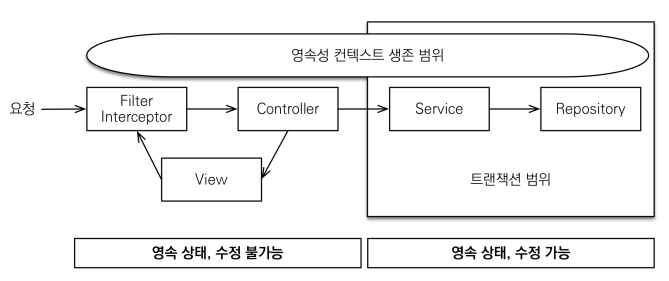
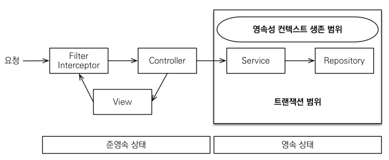

`@Transactional` : 선언적 트랜잭션

1. `@Transactional` 어노테이션과 트랜잭션 시작점 : `@Transactional`이 붙은 메서드는 그 메서드가 시작될 때 트랜잭션이 시작되고, 메서드가 종료될 때 트랜잭션이 커밋되거나 롤백된다. 
2. `EntityManager(엔티티 매니저)`를 사용하여 쿼리를 생성하거나 엔티티를 영속화하는 경우, 이런 작업들은 트랜잭션 내에서 이루어져야 한다.
3. `EntityManager`를 사용하는 코드가 트랜잭션의 일부가 되려면 코드를 감싸는 메서드 혹은 클래스에 `@Transactional`이 선언되어 있어야 한다.
4. 컨트롤러와 서비스에서의 `@Transactional` 알고 사용하기 : 일반적으로 비즈니스 로직과 트랜잭션 관리는 서비스 계층에서 처리한다. 컨트롤러는 HTTP 요청을 받아 처리하는 역할에 집중하고 실제 비즈니스 로직은 서비스 계층에서 처리한다.
5. 따라서 컨트롤러에서는 `@Transactional`을 사용하지 않고 필요한 로직을 서비스 계층으로 분리하여 그곳에 `@Transactional`을 적용하는 것이 일반적이다.
6. `readOnly=true`와 같은 옵션은 데이터 조회 작업에서 성능 최적화를 위해 사용되는 것

OSIV(Open Session In View) : ON

`spring.jpa.open-in-view` : true(기본값)

트랜잭션이 시작처럼 데이터베이스 최초 커넥션 시작 지점부터 API 응답이 끝날 때까지 영속성 컨텍스트와 데이터베이스 커넥션을 유지한다.
지연 로딩은 영속성 컨텍스트가 존재해야 가능한 전략이고 영속성 컨텍스트는 기본적으로 데이터베이스 커넥션이 유지하고 있어야 한다.
**하지만 이렇게 오래 리소스를 사용하기 때문에 실시간 트래픽이 중요한 애플리케이션에서는 커넥션이 모자랄 수 있다.**

`spring.jpa.open-in-view` : false

트랜잭션을 종료할 때 영속성 컨텍스트를 닫으면서 데이터베이스 커넥션도 반환한다.
적당한 시간만큼을 활용할 수 있으나 이 방식은 지연 로딩을 활용하기 어렵다는 단점이 있다.